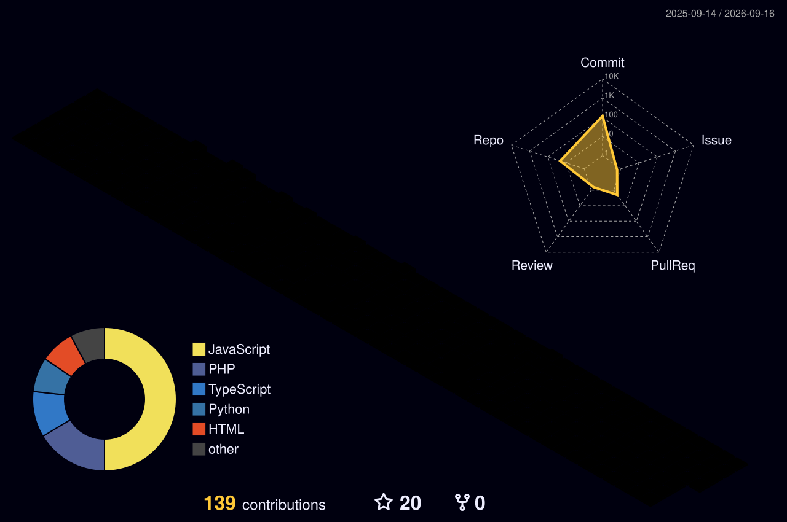
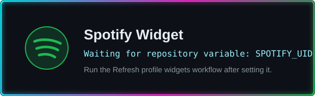

<p align="center">
  
</p>

<p align="center">
  <a href="https://github.com/Habiboullah-Afouk">
    
  </a>
  <a href="https://github.com/Habiboullah-Afouk?tab=followers">
    
  </a>
  <a href="https://github.com/Habiboullah-Afouk?tab=repositories">
    
  </a>
</p>

<p align="center">
  
</p>

---

## ⚡ Neural Stack

<h3 align="center">🖥️ Frontend</h3>
<p align="center">
  
  
  
  
  
  
</p>

<h3 align="center">⚙️ Backend & Frameworks</h3>
<p align="center">
  
  
  
  
  
</p>

<h3 align="center">🗄️ Databases</h3>
<p align="center">
  
  
  
</p>

<h3 align="center">📱 Mobile & Desktop</h3>
<p align="center">
  
  
</p>

<h3 align="center">🛠️ DevOps & Tools</h3>
<p align="center">
  
  
  
  
  
  
</p>

---

## Projects

<table>
  <tr>
    <td width="50%" valign="top">
      <h3>Full-stack App Lab</h3>
      <p>Real-world web apps with backend logic, clean interfaces, and database-driven workflows.</p>
      <p><strong>Tech:</strong> Laravel, MySQL, JavaScript, CSS</p>
    </td>
    <td width="50%" valign="top">
      <h3>Mobile Builds</h3>
      <p>Mobile-first experiments focused on practical flows, readable code, and fast iteration.</p>
      <p><strong>Tech:</strong> Expo, React Native, APIs</p>
    </td>
  </tr>
  <tr>
    <td width="50%" valign="top">
      <h3>Number Game</h3>
      <p>Interactive number guessing game with clean UI states and straightforward game logic.</p>
      <p><strong>Tech:</strong> JavaScript, HTML, CSS</p>
    </td>
    <td width="50%" valign="top">
      <h3>Homelab Project</h3>
      <p>Personal homelab for hosting apps, cloud storage, and self-hosted services.</p>
      <p><strong>Tech:</strong> Linux, Docker, SSH, NGINX</p>
    </td>
  </tr>
</table>

---

## GitHub Analytics

<p align="center">
  
  
</p>

<p align="center">
  
</p>

---

## GitHub Streak

<p align="center">
  
</p>

---

## 3D Contribution Graph

<p align="center">
  
</p>

---

## Contribution Graph

<p align="center">
  
</p>

---

## Contribution Snake

<picture>
  <source
    media="(prefers-color-scheme: dark)"
    srcset="https://cdn.jsdelivr.net/gh/Habiboullah-Afouk/Habiboullah-Afouk@main/assets/snake/github-contribution-grid-snake-dark.svg"
  />
  <source
    media="(prefers-color-scheme: light)"
    srcset="https://cdn.jsdelivr.net/gh/Habiboullah-Afouk/Habiboullah-Afouk@main/assets/snake/github-contribution-grid-snake.svg"
  />
  
</picture>

---

## Spotify Widget

<!-- SPOTIFY-WIDGET:START -->
<p align="center">
  
</p>
<!-- SPOTIFY-WIDGET:END -->

---

## Anime GIF Section

<p align="center">
  
</p>

---


## Current Focus

```txt
> Building full-stack applications
> Developing mobile apps
> Learning cloud and DevOps
> Creating AI-themed interfaces with cyberpunk energy
```

---

## Widget Configuration

The generated widgets above update through `.github/workflows/readme-widgets.yml`.
Set these repository variables in GitHub, then run the workflow manually:

| Variable | Used for |
| --- | --- |
| `SPOTIFY_UID` | Spotify profile widget |
| `WAKATIME_USERNAME` | WakaTime coding stats |
| `DISCORD_USER_ID` | Discord presence card |
| `LEETCODE_USERNAME` | LeetCode stats card |
| `BLOG_FEED_URLS` | Dynamic blog posts, comma-separated RSS or Atom feeds |

For richer private GitHub analytics, add a `METRICS_TOKEN` repository secret. Without it, the metrics workflow uses the built-in `GITHUB_TOKEN` and public profile data.

---

<p align="center">
  
</p>
